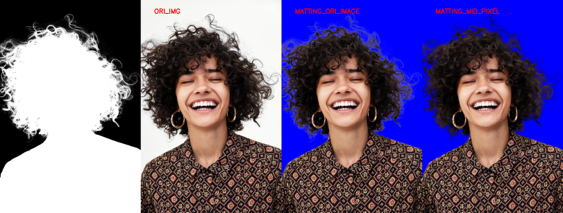
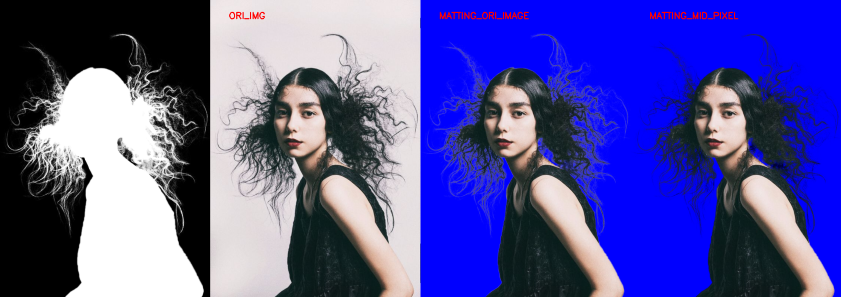

# Post-Processing-for-Matting
We often change background after matting. But due to the matting precision, the edge of body, especially hair, often leak pixels contain background, so we need some post-processing like this.

